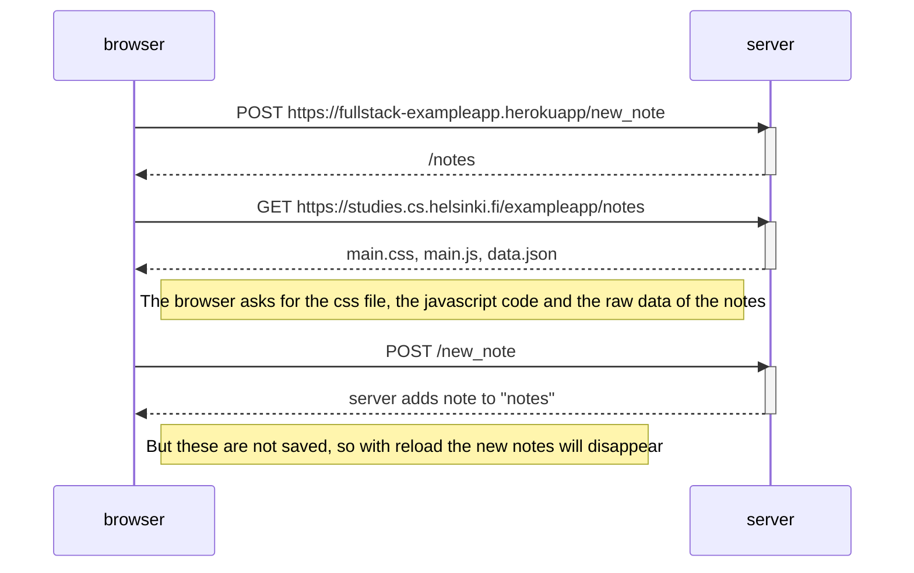

```mermaid
sequenceDiagram
    participant browser
    participant server

    browser->>server: POST https://fullstack-exampleapp.herokuapp/new_note
    activate server
    server-->>browser: /notes
    deactivate server

    browser->>server: GET https://studies.cs.helsinki.fi/exampleapp/notes
    activate server
    server-->>browser: main.css, main.js, data.json
    deactivate server

    Note right of browser: The browser asks for the css file, the javascript code and the raw data of the notes


    browser->>server: POST /new_note
    activate server
    server-->>browser: server adds note to "notes"
    deactivate server

    Note right of browser: But these are not saved, so with reload the new notes will disappear
```
