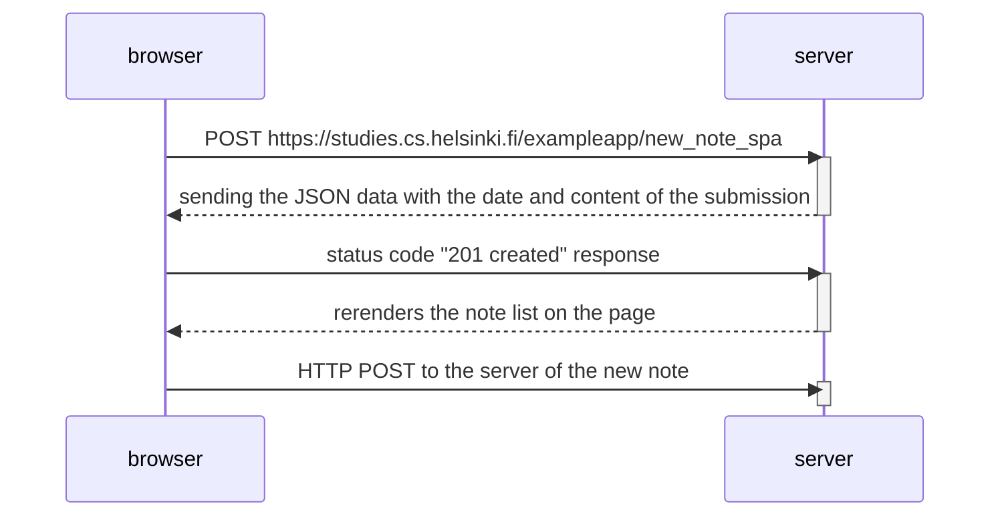

```mermaid
sequenceDiagram
    participant browser
    participant server

    browser->>server: POST https://studies.cs.helsinki.fi/exampleapp/new_note_spa
    activate server
    server-->>browser: sending the JSON data with the date and content of the submission
    deactivate server

    browser->>server: status code "201 created" response
    activate server
    server-->>browser: rerenders the note list on the page
    deactivate server


    browser->>server:  HTTP POST to the server of the new note
    activate server
    deactivate server
```
